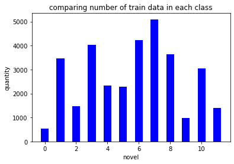
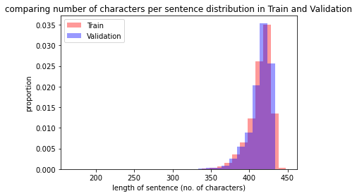
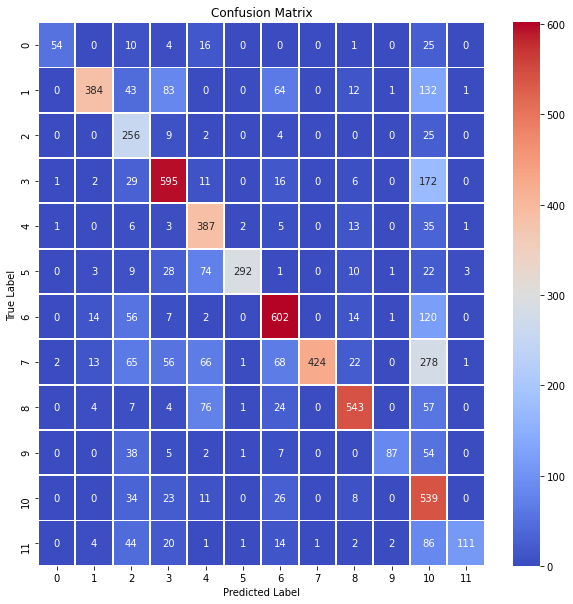
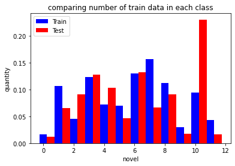

# Classification of Obfuscated Text

Import libraries 


```python
import numpy as np
import matplotlib.pyplot as plt
from sklearn.model_selection import train_test_split
from sklearn import metrics
import string
import seaborn as sns
```


```python
from keras.models import load_model
from keras.optimizers import RMSprop,Adam
from keras.preprocessing.text import Tokenizer
from keras.preprocessing import sequence
from keras.utils import to_categorical
```

    Using TensorFlow backend.
    


```python
# Import configuration files and model
from config import cfg
from RNN import RNN
```

# Data preparation


```python
#Import data and labels for training 
X_raw = open('xtrain_obfuscated.txt', 'r')
X = [data.strip('\n') for data in X_raw]
```


```python
# See sample data
print(X[0])

```

    satwamuluhqgulamlrmvezuhqvkrpmletwulcitwskuhlemvtwamuluhiwiwenuhlrvimvqvkruhulenamuluhqgqvtwvimviwuhtwamuluhulqvkrenamcitwuhvipmpmqvuhskiwkrpmdfuhlrvimvskvikrpmqvuhskmvgzenleuhqvmvamuluhulenamuluhqvletwtwvipmpmgzleenamuhtwamuluhtwletwdfuhiwkrxeleentwxeuhpmqvuhtwiwmvamdfuhpkeztwamuluhvimvuhqvtwmkpmpmlelruhgztwtwskuhtwlrkrpmlruhpmuluhqvenuhtwyplepmxeuhenuhamypkrqvuhamulmvdfuhqvskentwamletwlrlrpmiwuhtwamul
    

We can observe the fllowing :

    * There is no blank space in line. This implies that we cannot separate a line in terms of "words", but in terms of characters.
    
    * The characters used are small case alphaets only. Hence vocabulary size is 26.
    


```python
#Label list. Not used but for refernce.
Y_label = open('ylabel.txt','r').read().split('\n') 
#Y_label = [int(data.strip('\n')) for data in Y_label]
print(Y_label)
```

    ['alice_in_wonderland', 'dracula', 'dubliners', 'great_expectations', 'hard_times', 'huckleberry_finn', 'les_miserable', 'moby_dick', 'oliver_twist', 'peter_pan', 'talw_of_two_cities', 'tom_sawyer']
    


```python
# Import the labels for the training. 
Y_raw = open('ytrain.txt','r')
Y = [int(data.strip('\n')) for data in Y_raw]

```


```python
import matplotlib.pyplot as plt

plt.hist(Y, bins=range(min(Y), max(Y) + 2, 1),
              alpha=1,rwidth =0.5,align ="left", color="blue")
plt.xlabel("novel")
plt.ylabel("quantity")
plt.title("comparing number of train data in each class")
plt.show()
```





We can see that the classes are imbalanced. Novel 8 has almost 10 times the sample of Novel 1.


```python
X_train, X_val, Y_train, Y_val = train_test_split(X, Y, test_size=0.20)
```


```python
#The label is one hot encoded for the 12 novels to match the final output layer of the network.
Y_train = to_categorical(Y_train)
print(Y_train[0:10])
print(np.shape(Y_train))
```

    [[0. 0. 0. 1. 0. 0. 0. 0. 0. 0. 0. 0.]
     [0. 1. 0. 0. 0. 0. 0. 0. 0. 0. 0. 0.]
     [1. 0. 0. 0. 0. 0. 0. 0. 0. 0. 0. 0.]
     [0. 0. 0. 0. 0. 0. 1. 0. 0. 0. 0. 0.]
     [0. 0. 0. 0. 0. 0. 0. 0. 0. 0. 0. 1.]
     [0. 0. 0. 0. 0. 0. 0. 1. 0. 0. 0. 0.]
     [0. 0. 0. 0. 0. 0. 1. 0. 0. 0. 0. 0.]
     [0. 0. 0. 0. 0. 0. 0. 1. 0. 0. 0. 0.]
     [0. 0. 0. 0. 0. 0. 0. 0. 0. 0. 0. 1.]
     [0. 0. 0. 0. 0. 0. 0. 0. 1. 0. 0. 0.]]
    (26010, 12)
    


```python
# Length of train and validation data distribution

sentence_lengths_train = [ len(sent) for sent in X_train]
sentence_lengths_test = [ len(sent) for sent in X_val]

plt.hist(sentence_lengths_train, bins=range(min(sentence_lengths_train), max(sentence_lengths_train) + 1, 10), 
              alpha=0.4, color="red", density=True)
plt.hist(sentence_lengths_test, bins=range(min(sentence_lengths_test), max(sentence_lengths_test) + 1, 10),
              alpha=0.4, color="blue", density=True)
labels = ['Train',"Validation"]
plt.legend(labels)
plt.xlabel("length of sentence (no. of characters)")
plt.ylabel("proportion")
plt.title("comparing number of characters per sentence distribution in Train and Validation")
plt.show()
```





The distribution in traning data set and test data set is almost similar!

## Data Preprocesing : Tokenizing the data set 

To feed the data to the network, the dtaa set has to be converted to "tokens". As the sentences do not have "words", we cannot use the words as tokens. Hence we tokenize eash character in the line.  

This implies that the vocabulary size(number of tokens) is same as alphabts in the data = 26.

The maximum length of the sentence is around 450 and we use 500 as the maximum length.


```python
# define funtion for tokenizing the characters.
def initialize_alpha_numeric(length):
    alpha_to_num = dict(zip(string.ascii_lowercase, range(1, length)))
    return alpha_to_num
```


```python
# Tokenize each lines such that the characters in each line is replaced in sequence by encoded number.
total_size = len(X_train)
sequences = np.zeros((total_size, cfg.max_len), dtype=np.int)
for i in range(total_size):
    x = np.zeros(cfg.max_len, dtype=np.int)
    for j in range(cfg.max_len):
        if j < len(X_train[i]):
            x[j] = initialize_alpha_numeric(27)[X_train[i][j]]
        else:
            x[j] = 0
    sequences[i] = np.copy(x)

```


```python
#Example of tokenizing
print(X_train[0])
print(sequences[0])
```

    iguhulenamdfuhskvienulqvletwskvikruhkrpmrbuhraulqveniwuhulenuhqgdfpmviuhkrpmsauhiwiwtwuluhulqvkrezuhiguhqgamypulmvdflrenqjuhleentwmcnkuhratwezuhulenuhsaiwtwulenvipmmvulyptwxexeenuhulqvpmezuhsktwucpmpmiwuhtwamuhskvienuhqglrvimviwmvtwypuhtwulmvamdfuhtwamuluhulenuhucpmpmiwuhskmvypeniwgzuhtwamuluhezpmlexeuheziwmvxeuhtwamuluhucypentvuhdftwleskuhqgtwqvmvpmviuhulkrpmamulmvdfuhtwskenezuhqvendfuhulmvuhamlrkrpmamul
    [ 9  7 21  8 21 12  5 14  1 13  4  6 21  8 19 11 22  9  5 14 21 12 17 22
     12  5 20 23 19 11 22  9 11 18 21  8 11 18 16 13 18  2 21  8 18  1 21 12
     17 22  5 14  9 23 21  8 21 12  5 14 21  8 17  7  4  6 16 13 22  9 21  8
     11 18 16 13 19  1 21  8  9 23  9 23 20 23 21 12 21  8 21 12 17 22 11 18
      5 26 21  8  9  7 21  8 17  7  1 13 25 16 21 12 13 22  4  6 12 18  5 14
     17 10 21  8 12  5  5 14 20 23 13  3 14 11 21  8 18  1 20 23  5 26 21  8
     21 12  5 14 21  8 19  1  9 23 20 23 21 12  5 14 22  9 16 13 13 22 21 12
     25 16 20 23 24  5 24  5  5 14 21  8 21 12 17 22 16 13  5 26 21  8 19 11
     20 23 21  3 16 13 16 13  9 23 21  8 20 23  1 13 21  8 19 11 22  9  5 14
     21  8 17  7 12 18 22  9 13 22  9 23 13 22 20 23 25 16 21  8 20 23 21 12
     13 22  1 13  4  6 21  8 20 23  1 13 21 12 21  8 21 12  5 14 21  8 21  3
     16 13 16 13  9 23 21  8 19 11 13 22 25 16  5 14  9 23  7 26 21  8 20 23
      1 13 21 12 21  8  5 26 16 13 12  5 24  5 21  8  5 26  9 23 13 22 24  5
     21  8 20 23  1 13 21 12 21  8 21  3 25 16  5 14 20 22 21  8  4  6 20 23
     12  5 19 11 21  8 17  7 20 23 17 22 13 22 16 13 22  9 21  8 21 12 11 18
     16 13  1 13 21 12 13 22  4  6 21  8 20 23 19 11  5 14  5 26 21  8 17 22
      5 14  4  6 21  8 21 12 13 22 21  8  1 13 12 18 11 18 16 13  1 13 21 12
      0  0  0  0  0  0  0  0  0  0  0  0  0  0  0  0  0  0  0  0  0  0  0  0
      0  0  0  0  0  0  0  0  0  0  0  0  0  0  0  0  0  0  0  0  0  0  0  0
      0  0  0  0  0  0  0  0  0  0  0  0  0  0  0  0  0  0  0  0  0  0  0  0
      0  0  0  0  0  0  0  0  0  0  0  0  0  0  0  0  0  0  0  0]
    

# Training


```python
#Compile the model
model = RNN()
model.summary()
model.compile(loss='binary_crossentropy',optimizer=RMSprop(),metrics=['accuracy'])
```

    Model: "model_1"
    _________________________________________________________________
    Layer (type)                 Output Shape              Param #   
    =================================================================
    inputs (InputLayer)          (None, 500)               0         
    _________________________________________________________________
    embedding_1 (Embedding)      (None, 500, 13)           351       
    _________________________________________________________________
    batch_normalization_1 (Batch (None, 500, 13)           52        
    _________________________________________________________________
    dropout_1 (Dropout)          (None, 500, 13)           0         
    _________________________________________________________________
    conv1d_1 (Conv1D)            (None, 496, 64)           4224      
    _________________________________________________________________
    max_pooling1d_1 (MaxPooling1 (None, 124, 64)           0         
    _________________________________________________________________
    lstm_1 (LSTM)                (None, 64)                33024     
    _________________________________________________________________
    batch_normalization_2 (Batch (None, 64)                256       
    _________________________________________________________________
    dropout_2 (Dropout)          (None, 64)                0         
    _________________________________________________________________
    FC1 (Dense)                  (None, 128)               8320      
    _________________________________________________________________
    out_layer (Dense)            (None, 12)                1548      
    _________________________________________________________________
    activation_1 (Activation)    (None, 12)                0         
    =================================================================
    Total params: 47,775
    Trainable params: 47,621
    Non-trainable params: 154
    _________________________________________________________________
    


```python
#Fit on training data
model.fit(sequences,Y_train,batch_size=cfg.batch_size,epochs=cfg.epochs, validation_split=0.2)
```

    C:\Users\sudha\anaconda3\envs\tf2_py3\lib\site-packages\tensorflow_core\python\framework\indexed_slices.py:433: UserWarning: Converting sparse IndexedSlices to a dense Tensor of unknown shape. This may consume a large amount of memory.
      "Converting sparse IndexedSlices to a dense Tensor of unknown shape. "
    

    Train on 20808 samples, validate on 5202 samples
    Epoch 1/100
    20808/20808 [==============================] - 51s 2ms/step - loss: 0.2670 - accuracy: 0.9171 - val_loss: 0.4579 - val_accuracy: 0.8679
    Epoch 2/100
    20808/20808 [==============================] - 51s 2ms/step - loss: 0.2392 - accuracy: 0.9197 - val_loss: 0.5675 - val_accuracy: 0.8584
    Epoch 3/100
    20808/20808 [==============================] - 52s 3ms/step - loss: 0.2257 - accuracy: 0.9217 - val_loss: 0.2560 - val_accuracy: 0.9213
    Epoch 4/100
    20808/20808 [==============================] - 61s 3ms/step - loss: 0.2147 - accuracy: 0.9237 - val_loss: 0.2492 - val_accuracy: 0.9119
    Epoch 5/100
    20808/20808 [==============================] - 62s 3ms/step - loss: 0.2055 - accuracy: 0.9264 - val_loss: 0.4277 - val_accuracy: 0.8719
    Epoch 6/100
    20808/20808 [==============================] - 58s 3ms/step - loss: 0.1909 - accuracy: 0.9309 - val_loss: 0.2491 - val_accuracy: 0.9159
    Epoch 7/100
    20808/20808 [==============================] - 54s 3ms/step - loss: 0.1802 - accuracy: 0.9343 - val_loss: 0.3173 - val_accuracy: 0.9024
    Epoch 8/100
    20808/20808 [==============================] - 55s 3ms/step - loss: 0.1737 - accuracy: 0.9359 - val_loss: 0.3704 - val_accuracy: 0.8933
    Epoch 9/100
    20808/20808 [==============================] - 53s 3ms/step - loss: 0.1692 - accuracy: 0.9371 - val_loss: 0.1973 - val_accuracy: 0.9296
    Epoch 10/100
    20808/20808 [==============================] - 58s 3ms/step - loss: 0.1655 - accuracy: 0.9386 - val_loss: 0.2441 - val_accuracy: 0.9210
    Epoch 11/100
    20808/20808 [==============================] - 58s 3ms/step - loss: 0.1624 - accuracy: 0.9401 - val_loss: 0.2385 - val_accuracy: 0.9207
    Epoch 12/100
    20808/20808 [==============================] - 53s 3ms/step - loss: 0.1601 - accuracy: 0.9406 - val_loss: 0.2279 - val_accuracy: 0.9238
    Epoch 13/100
    20808/20808 [==============================] - 58s 3ms/step - loss: 0.1578 - accuracy: 0.9412 - val_loss: 0.1801 - val_accuracy: 0.9333
    Epoch 14/100
    20808/20808 [==============================] - 55s 3ms/step - loss: 0.1565 - accuracy: 0.9413 - val_loss: 0.3116 - val_accuracy: 0.9051
    Epoch 15/100
    20808/20808 [==============================] - 55s 3ms/step - loss: 0.1536 - accuracy: 0.9422 - val_loss: 0.1951 - val_accuracy: 0.9294
    Epoch 16/100
    20808/20808 [==============================] - 55s 3ms/step - loss: 0.1518 - accuracy: 0.9426 - val_loss: 0.2005 - val_accuracy: 0.9293
    Epoch 17/100
    20808/20808 [==============================] - 61s 3ms/step - loss: 0.1498 - accuracy: 0.9440 - val_loss: 0.2649 - val_accuracy: 0.9116
    Epoch 18/100
    20808/20808 [==============================] - 56s 3ms/step - loss: 0.1473 - accuracy: 0.9445 - val_loss: 0.2106 - val_accuracy: 0.9240
    Epoch 19/100
    20808/20808 [==============================] - 63s 3ms/step - loss: 0.1452 - accuracy: 0.9450 - val_loss: 0.1823 - val_accuracy: 0.9350
    Epoch 20/100
    20808/20808 [==============================] - 58s 3ms/step - loss: 0.1442 - accuracy: 0.9454 - val_loss: 0.1508 - val_accuracy: 0.9432
    Epoch 21/100
    20808/20808 [==============================] - 62s 3ms/step - loss: 0.1427 - accuracy: 0.9461 - val_loss: 0.1749 - val_accuracy: 0.9363
    Epoch 22/100
    20808/20808 [==============================] - 55s 3ms/step - loss: 0.1401 - accuracy: 0.9474 - val_loss: 0.1857 - val_accuracy: 0.9328
    Epoch 23/100
    20808/20808 [==============================] - 55s 3ms/step - loss: 0.1396 - accuracy: 0.9470 - val_loss: 0.1386 - val_accuracy: 0.9472
    Epoch 24/100
    20808/20808 [==============================] - 57s 3ms/step - loss: 0.1369 - accuracy: 0.9482 - val_loss: 0.2721 - val_accuracy: 0.9143
    Epoch 25/100
    20808/20808 [==============================] - 61s 3ms/step - loss: 0.1355 - accuracy: 0.9490 - val_loss: 0.2084 - val_accuracy: 0.9294
    Epoch 26/100
    20808/20808 [==============================] - 60s 3ms/step - loss: 0.1344 - accuracy: 0.9490 - val_loss: 0.3097 - val_accuracy: 0.9087
    Epoch 27/100
    20808/20808 [==============================] - 59s 3ms/step - loss: 0.1324 - accuracy: 0.9498 - val_loss: 0.1936 - val_accuracy: 0.9336
    Epoch 28/100
    20808/20808 [==============================] - 61s 3ms/step - loss: 0.1313 - accuracy: 0.9500 - val_loss: 0.1521 - val_accuracy: 0.9428
    Epoch 29/100
    20808/20808 [==============================] - 59s 3ms/step - loss: 0.1296 - accuracy: 0.9505 - val_loss: 0.1724 - val_accuracy: 0.9384
    Epoch 30/100
    20808/20808 [==============================] - 60s 3ms/step - loss: 0.1285 - accuracy: 0.9510 - val_loss: 0.2127 - val_accuracy: 0.9242
    Epoch 31/100
    20808/20808 [==============================] - 55s 3ms/step - loss: 0.1278 - accuracy: 0.9515 - val_loss: 0.2233 - val_accuracy: 0.9241
    Epoch 32/100
    20808/20808 [==============================] - 55s 3ms/step - loss: 0.1260 - accuracy: 0.9521 - val_loss: 0.1469 - val_accuracy: 0.9464
    Epoch 33/100
    20808/20808 [==============================] - 55s 3ms/step - loss: 0.1252 - accuracy: 0.9523 - val_loss: 0.2520 - val_accuracy: 0.9212
    Epoch 34/100
    20808/20808 [==============================] - 56s 3ms/step - loss: 0.1234 - accuracy: 0.9529 - val_loss: 0.1974 - val_accuracy: 0.9311
    Epoch 35/100
    20808/20808 [==============================] - 57s 3ms/step - loss: 0.1221 - accuracy: 0.9535 - val_loss: 0.1513 - val_accuracy: 0.9457
    Epoch 36/100
    20808/20808 [==============================] - 57s 3ms/step - loss: 0.1209 - accuracy: 0.9542 - val_loss: 0.1467 - val_accuracy: 0.9476
    Epoch 37/100
    20808/20808 [==============================] - 55s 3ms/step - loss: 0.1188 - accuracy: 0.9545 - val_loss: 0.1988 - val_accuracy: 0.9361
    Epoch 38/100
    20808/20808 [==============================] - 55s 3ms/step - loss: 0.1188 - accuracy: 0.9545 - val_loss: 0.2469 - val_accuracy: 0.9208
    Epoch 39/100
    20808/20808 [==============================] - 55s 3ms/step - loss: 0.1173 - accuracy: 0.9552 - val_loss: 0.1812 - val_accuracy: 0.9378
    Epoch 40/100
    20808/20808 [==============================] - 56s 3ms/step - loss: 0.1166 - accuracy: 0.9557 - val_loss: 0.1382 - val_accuracy: 0.9484
    Epoch 41/100
    20808/20808 [==============================] - 58s 3ms/step - loss: 0.1152 - accuracy: 0.9560 - val_loss: 0.1559 - val_accuracy: 0.9454
    Epoch 42/100
    20808/20808 [==============================] - 56s 3ms/step - loss: 0.1155 - accuracy: 0.9559 - val_loss: 0.1849 - val_accuracy: 0.9371
    Epoch 43/100
    20808/20808 [==============================] - 56s 3ms/step - loss: 0.1137 - accuracy: 0.9568 - val_loss: 0.2439 - val_accuracy: 0.9240
    Epoch 44/100
    20808/20808 [==============================] - 55s 3ms/step - loss: 0.1119 - accuracy: 0.9572 - val_loss: 0.1736 - val_accuracy: 0.9406
    Epoch 45/100
    20808/20808 [==============================] - 55s 3ms/step - loss: 0.1111 - accuracy: 0.9574 - val_loss: 0.1739 - val_accuracy: 0.9387
    Epoch 46/100
    20808/20808 [==============================] - 55s 3ms/step - loss: 0.1102 - accuracy: 0.9578 - val_loss: 0.1390 - val_accuracy: 0.9496
    Epoch 47/100
    20808/20808 [==============================] - 58s 3ms/step - loss: 0.1101 - accuracy: 0.9582 - val_loss: 0.1336 - val_accuracy: 0.9500
    Epoch 48/100
    20808/20808 [==============================] - 55s 3ms/step - loss: 0.1081 - accuracy: 0.9588 - val_loss: 0.1766 - val_accuracy: 0.9414
    Epoch 49/100
    20808/20808 [==============================] - 56s 3ms/step - loss: 0.1086 - accuracy: 0.9584 - val_loss: 0.1121 - val_accuracy: 0.9572
    Epoch 50/100
    20808/20808 [==============================] - 56s 3ms/step - loss: 0.1068 - accuracy: 0.9593 - val_loss: 0.1328 - val_accuracy: 0.9511
    Epoch 51/100
    20808/20808 [==============================] - 56s 3ms/step - loss: 0.1061 - accuracy: 0.9596 - val_loss: 0.1568 - val_accuracy: 0.9440
    Epoch 52/100
    20808/20808 [==============================] - 55s 3ms/step - loss: 0.1043 - accuracy: 0.9602 - val_loss: 0.1284 - val_accuracy: 0.9530
    Epoch 53/100
    20808/20808 [==============================] - 58s 3ms/step - loss: 0.1039 - accuracy: 0.9601 - val_loss: 0.1782 - val_accuracy: 0.9375
    Epoch 54/100
    20808/20808 [==============================] - 54s 3ms/step - loss: 0.1038 - accuracy: 0.9606 - val_loss: 0.1863 - val_accuracy: 0.9348
    Epoch 55/100
    20808/20808 [==============================] - 55s 3ms/step - loss: 0.1020 - accuracy: 0.9610 - val_loss: 0.2263 - val_accuracy: 0.9322
    Epoch 56/100
    20808/20808 [==============================] - 55s 3ms/step - loss: 0.1033 - accuracy: 0.9602 - val_loss: 0.1150 - val_accuracy: 0.9555
    Epoch 57/100
    20808/20808 [==============================] - 56s 3ms/step - loss: 0.1017 - accuracy: 0.9613 - val_loss: 0.1669 - val_accuracy: 0.9415
    Epoch 58/100
    20808/20808 [==============================] - 57s 3ms/step - loss: 0.1008 - accuracy: 0.9617 - val_loss: 0.1383 - val_accuracy: 0.9499
    Epoch 59/100
    20808/20808 [==============================] - 56s 3ms/step - loss: 0.1006 - accuracy: 0.9614 - val_loss: 0.1178 - val_accuracy: 0.9576
    Epoch 60/100
    20808/20808 [==============================] - 56s 3ms/step - loss: 0.0993 - accuracy: 0.9619 - val_loss: 0.1589 - val_accuracy: 0.9457
    Epoch 61/100
    20808/20808 [==============================] - 56s 3ms/step - loss: 0.0988 - accuracy: 0.9620 - val_loss: 0.0987 - val_accuracy: 0.9620
    Epoch 62/100
    20808/20808 [==============================] - 55s 3ms/step - loss: 0.0990 - accuracy: 0.9622 - val_loss: 0.1059 - val_accuracy: 0.9597
    Epoch 63/100
    20808/20808 [==============================] - 56s 3ms/step - loss: 0.0980 - accuracy: 0.9625 - val_loss: 0.1882 - val_accuracy: 0.9398
    Epoch 64/100
    20808/20808 [==============================] - 57s 3ms/step - loss: 0.0979 - accuracy: 0.9625 - val_loss: 0.1100 - val_accuracy: 0.9585
    Epoch 65/100
    20808/20808 [==============================] - 57s 3ms/step - loss: 0.0962 - accuracy: 0.9632 - val_loss: 0.1228 - val_accuracy: 0.9551
    Epoch 66/100
    20808/20808 [==============================] - 55s 3ms/step - loss: 0.0954 - accuracy: 0.9632 - val_loss: 0.1529 - val_accuracy: 0.9457
    Epoch 67/100
    20808/20808 [==============================] - 55s 3ms/step - loss: 0.0960 - accuracy: 0.9635 - val_loss: 0.1734 - val_accuracy: 0.9425
    Epoch 68/100
    20808/20808 [==============================] - 56s 3ms/step - loss: 0.0955 - accuracy: 0.9636 - val_loss: 0.1078 - val_accuracy: 0.9590
    Epoch 69/100
    20808/20808 [==============================] - 56s 3ms/step - loss: 0.0947 - accuracy: 0.9640 - val_loss: 0.1113 - val_accuracy: 0.9578
    Epoch 70/100
    20808/20808 [==============================] - 58s 3ms/step - loss: 0.0934 - accuracy: 0.9640 - val_loss: 0.1325 - val_accuracy: 0.9530
    Epoch 71/100
    20808/20808 [==============================] - 57s 3ms/step - loss: 0.0935 - accuracy: 0.9638 - val_loss: 0.1143 - val_accuracy: 0.9564
    Epoch 72/100
    20808/20808 [==============================] - 55s 3ms/step - loss: 0.0931 - accuracy: 0.9642 - val_loss: 0.1425 - val_accuracy: 0.9478
    Epoch 73/100
    20808/20808 [==============================] - 56s 3ms/step - loss: 0.0923 - accuracy: 0.9649 - val_loss: 0.1051 - val_accuracy: 0.9606
    Epoch 74/100
    20808/20808 [==============================] - 57s 3ms/step - loss: 0.0923 - accuracy: 0.9649 - val_loss: 0.1376 - val_accuracy: 0.9517
    Epoch 75/100
    20808/20808 [==============================] - 57s 3ms/step - loss: 0.0911 - accuracy: 0.9650 - val_loss: 0.1226 - val_accuracy: 0.9543
    Epoch 76/100
    20808/20808 [==============================] - 57s 3ms/step - loss: 0.0909 - accuracy: 0.9652 - val_loss: 0.1073 - val_accuracy: 0.9604
    Epoch 77/100
    20808/20808 [==============================] - 55s 3ms/step - loss: 0.0910 - accuracy: 0.9649 - val_loss: 0.1758 - val_accuracy: 0.9408
    Epoch 78/100
    20808/20808 [==============================] - 56s 3ms/step - loss: 0.0906 - accuracy: 0.9655 - val_loss: 0.1205 - val_accuracy: 0.9556
    Epoch 79/100
    20808/20808 [==============================] - 55s 3ms/step - loss: 0.0898 - accuracy: 0.9655 - val_loss: 0.1695 - val_accuracy: 0.9447
    Epoch 80/100
    20808/20808 [==============================] - 55s 3ms/step - loss: 0.0896 - accuracy: 0.9661 - val_loss: 0.1597 - val_accuracy: 0.9415
    Epoch 81/100
    20808/20808 [==============================] - 58s 3ms/step - loss: 0.0886 - accuracy: 0.9658 - val_loss: 0.1230 - val_accuracy: 0.9558
    Epoch 82/100
    20808/20808 [==============================] - 56s 3ms/step - loss: 0.0889 - accuracy: 0.9661 - val_loss: 0.1302 - val_accuracy: 0.9534
    Epoch 83/100
    20808/20808 [==============================] - 55s 3ms/step - loss: 0.0869 - accuracy: 0.9671 - val_loss: 0.1122 - val_accuracy: 0.9596
    Epoch 84/100
    20808/20808 [==============================] - 56s 3ms/step - loss: 0.0873 - accuracy: 0.9665 - val_loss: 0.1246 - val_accuracy: 0.9543
    Epoch 85/100
    20808/20808 [==============================] - 55s 3ms/step - loss: 0.0870 - accuracy: 0.9668 - val_loss: 0.1539 - val_accuracy: 0.9479
    Epoch 86/100
    20808/20808 [==============================] - 55s 3ms/step - loss: 0.0874 - accuracy: 0.9666 - val_loss: 0.1479 - val_accuracy: 0.9509
    Epoch 87/100
    20808/20808 [==============================] - 58s 3ms/step - loss: 0.0861 - accuracy: 0.9673 - val_loss: 0.1345 - val_accuracy: 0.9540
    Epoch 88/100
    20808/20808 [==============================] - 55s 3ms/step - loss: 0.0854 - accuracy: 0.9673 - val_loss: 0.1009 - val_accuracy: 0.9616
    Epoch 89/100
    20808/20808 [==============================] - 55s 3ms/step - loss: 0.0856 - accuracy: 0.9676 - val_loss: 0.1752 - val_accuracy: 0.9428
    Epoch 90/100
    20808/20808 [==============================] - 56s 3ms/step - loss: 0.0864 - accuracy: 0.9670 - val_loss: 0.1214 - val_accuracy: 0.9575
    Epoch 91/100
    20808/20808 [==============================] - 56s 3ms/step - loss: 0.0843 - accuracy: 0.9676 - val_loss: 0.1312 - val_accuracy: 0.9550
    Epoch 92/100
    20808/20808 [==============================] - 55s 3ms/step - loss: 0.0837 - accuracy: 0.9679 - val_loss: 0.1596 - val_accuracy: 0.9488
    Epoch 93/100
    20808/20808 [==============================] - 59s 3ms/step - loss: 0.0840 - accuracy: 0.9678 - val_loss: 0.1422 - val_accuracy: 0.9528
    Epoch 94/100
    20808/20808 [==============================] - 56s 3ms/step - loss: 0.0835 - accuracy: 0.9676 - val_loss: 0.1022 - val_accuracy: 0.9616
    Epoch 95/100
    20808/20808 [==============================] - 56s 3ms/step - loss: 0.0832 - accuracy: 0.9682 - val_loss: 0.1669 - val_accuracy: 0.9464
    Epoch 96/100
    20808/20808 [==============================] - 55s 3ms/step - loss: 0.0836 - accuracy: 0.9680 - val_loss: 0.0987 - val_accuracy: 0.9634
    Epoch 97/100
    20808/20808 [==============================] - 56s 3ms/step - loss: 0.0816 - accuracy: 0.9689 - val_loss: 0.1275 - val_accuracy: 0.9548
    Epoch 98/100
    20808/20808 [==============================] - 56s 3ms/step - loss: 0.0821 - accuracy: 0.9687 - val_loss: 0.1386 - val_accuracy: 0.9531
    Epoch 99/100
    20808/20808 [==============================] - 58s 3ms/step - loss: 0.0822 - accuracy: 0.9690 - val_loss: 0.1618 - val_accuracy: 0.9482
    Epoch 100/100
    20808/20808 [==============================] - 56s 3ms/step - loss: 0.0814 - accuracy: 0.9689 - val_loss: 0.1522 - val_accuracy: 0.9489
    


    <keras.callbacks.callbacks.History at 0x2583665d308>


```python
#Save model
model.save_weights('rnn_weights.h5')
```

# Evaluation on Validation set


```python
# Tokenize each lines such that the characters in each line is replaced in sequence by encoded number.
total_size = len(X_val)
sequences_val = np.zeros((total_size, cfg.max_len), dtype=np.int)
for i in range(total_size):
    x = np.zeros(cfg.max_len, dtype=np.int)
    for j in range(cfg.max_len):
        if j < len(X_val[i]) - 1:
            x[j] = initialize_alpha_numeric(27)[X_val[i][j]]
        else:
            x[j] = 0
    sequences_val[i] = np.copy(x)
```


```python
pred = model.predict(sequences_val)
y_pred = np.zeros(total_size, dtype=np.int)
for i in range(total_size):
    y_pred[i] = np.argmax(pred[i])
```


```python
matrix = metrics.confusion_matrix(Y_val, y_pred)
plt.figure(figsize=(10, 10))
sns.heatmap(matrix,
            cmap='coolwarm',
            linecolor='white',
            linewidths=1,
            xticklabels=list(set(Y)),
            yticklabels=list(set(Y)),
            annot=True,
            fmt='d')
plt.title('Confusion Matrix')
plt.ylabel('True Label')
plt.xlabel('Predicted Label')
plt.show()
```





The performance of the model is good for most of the classes. The classes with more examples performed better as expected.

# Evaluation on Test set


```python
#Import data and labels
X_raw_test = open('xtest_obfuscated.txt', 'r')
X_test = [data.strip('\n') for data in X_raw_test]
```


```python
test_size = len(X_test)
sequences_test = np.zeros((total_size, cfg.max_len), dtype=np.int)
for i in range(test_size):
    x = np.zeros(cfg.max_len, dtype=np.int)
    for j in range(cfg.max_len):
        if j < len(X_test[i]):
            x[j] = initialize_alpha_numeric(27)[X_test[i][j]]
        else:
            x[j] = 0
    sequences_test[i] = np.copy(x)
```


```python
pred = model.predict(sequences_test)
y_test = np.zeros(test_size, dtype=np.int)
for i in range(test_size):
    y_test[i] = np.argmax(pred[i])
    
np.savetxt('y_pred.txt', [y_test],fmt='%i', delimiter='\n')
```

# Distribution of training and test set


```python
import matplotlib.pyplot as plt

plt.hist(Y, bins=range(min(Y), max(Y) + 2, 1),density = True,
              alpha=1,rwidth =0.5,align ='left', color="blue",label = 'Train')
plt.hist(y_test, bins=range(min(y_test), max(y_test) + 2, 1),density = True,
              alpha=1,rwidth =0.5,align ='mid', color="red",label = 'Test')
plt.xlabel("novel")
plt.ylabel("quantity")
plt.title("comparing number of train data in each class")
plt.legend()
plt.show()
```





The distribution of the data is almost same in the test and training data set giving good confidence for the model performance.
